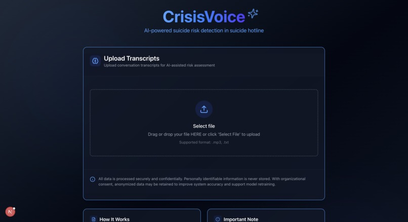
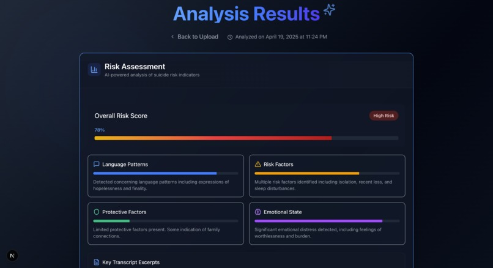
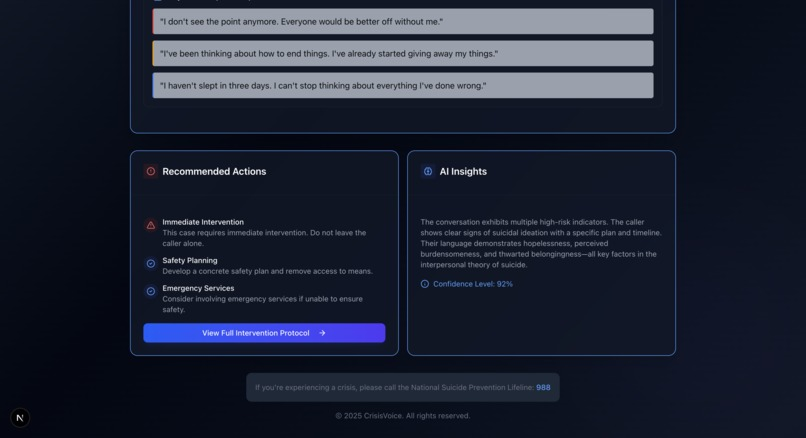

# CrisisVoice

### Inspiration
Every day, crisis hotline workers support people facing some of the most difficult moments of their lives. But even with training, it's hard to detect subtle indicators of suicide risk during high-pressure calls. We were inspired to build a tool that could support these professionals with real-time, AI-powered insights — not to replace human judgment, but to enhance it.

### What it does
CrisisVoice analyzes transcripts or audio from crisis hotline conversations to assess the risk of suicide. The platform uses natural language processing to detect concerning language patterns, emotional distress, risk, and protective factors, and assigns an overall risk score. It then suggests recommended actions and provides explainable insights to support hotline responders.

### How we built it
We built the front end using React and Tailwind CSS for a clean, responsive interface. For audio and text analysis, we combined our own trained NLP classifier model with custom logic hosted on a FastAPI backend. The system supports .mp3 and .txt uploads and securely processes data to extract suicide risk indicators in real time. Our analysis model integrates psychological theories, such as the Interpersonal Theory of Suicide.

### Challenges we ran into
- Designing a sensitive UX/UI that respects the nature of crisis data
- Synchronized multi GPUs for our model training
- Translate the model results into actual, meaningful insights for the operators
- Getting accurate emotion and intent detection within a limited time

### Accomplishments that we're proud of
- Delivered a fully functional and secure prototype in under 24 hours
- Successfully integrated NLP classifier model and risk scoring into a real-time system
- Created a meaningful tool that addresses a critical social issue
- Maintained ethical AI principles while designing for real-world impact

### What we learned
- How to rapidly prototype an AI-powered product under time pressure
- Deeper insights into mental health risk factors and how AI can assist, not replace, human professionals
- Technical skills in model integration, React/FastAPI communication, and risk evaluation design

### What's next for CrisisVoice
We hope to expand CrisisVoice into a full support platform that integrates directly with hotline call centers. Future plans include:

- Real-time transcript streaming and analysis
- Support for multilingual conversations
- Integration with electronic health records (EHR) systems
- Partnering with mental health organizations for pilot testing
- Fine-tuning models with domain-specific datasets (with proper ethics approval)
-  CrisisVoice has the potential to be a quiet but powerful assistant in life-saving conversations.

### Built With:
- groq
- machine-learning
- natural-language-processing
- next.js
- python
- pytorch
- react
- snowflake
- tailwindcss
- typescript